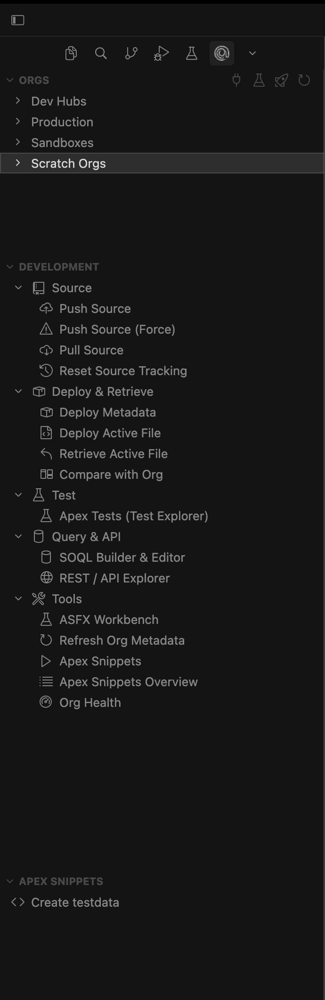
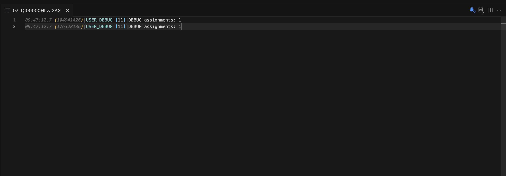
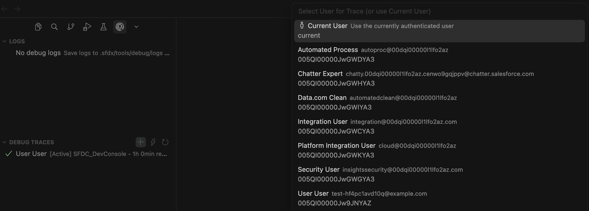
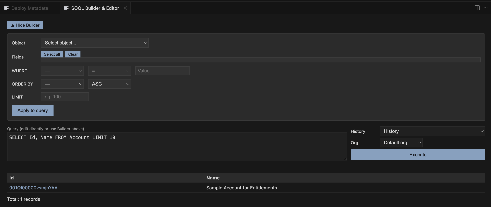
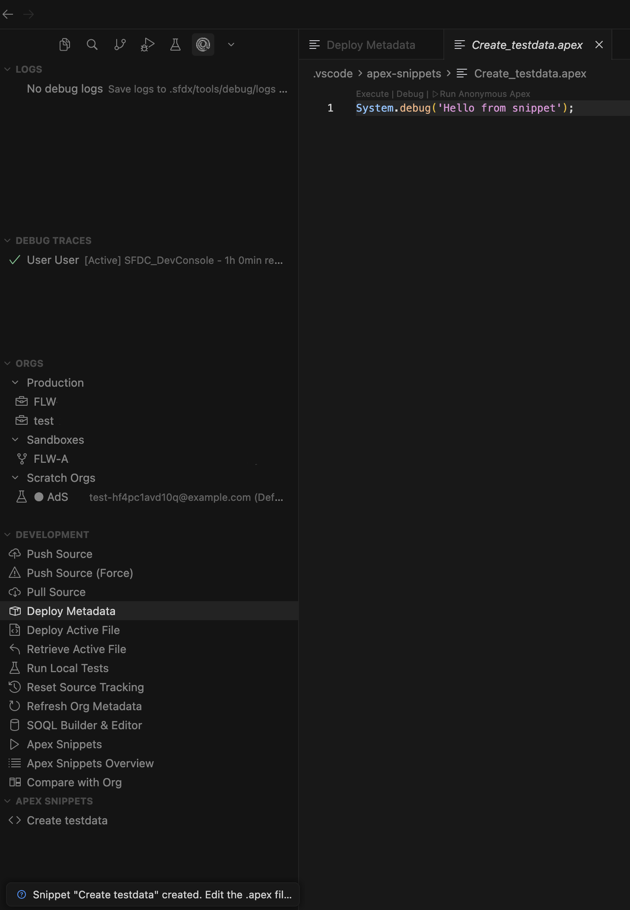
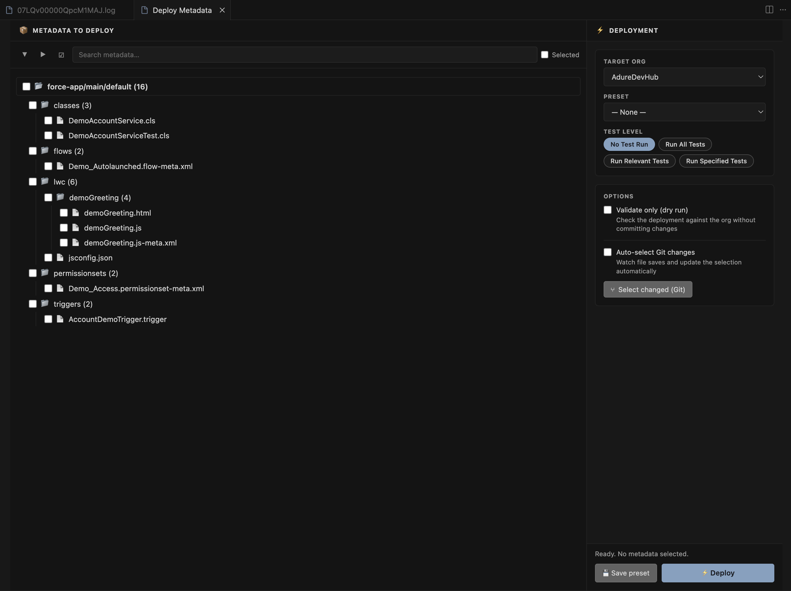

# ASFX Toolkit


ASFX Toolkit is an open-source VS Code / Cursor extension that supercharges your Salesforce development workflow. It bundles org-aware **Apex & SOQL IntelliSense**, log management & debugging, org management, source tracking & deployment, data operations, and API exploration — all without leaving the editor, and all driven by the Salesforce CLI you already have.

> Works on VS Code 1.80+ and Cursor. Activates automatically in any folder containing an `sfdx-project.json`; outside SFDX projects it stays completely inert.

## Features

### 🧠 Apex & SOQL IntelliSense

A built-in, **JVM-free** language server (pure Node, shipped inside the extension) that adds **org-aware** IntelliSense for Apex and SOQL. It runs alongside the official Salesforce Apex extension and only adds what that engine can't: live schema from your connected org.

**SOQL** — in `.soql` files, inline `[SELECT … ]` queries in Apex, and `Database.query('…')` strings:

- Object completion after `FROM`; field completion in `SELECT` / `WHERE` / `ORDER BY`, with type badges.
- **Relationship traversal** — `Account.Owner.Name` resolves through `__r` lookups.
- **Child-relationship subqueries** — `(SELECT … FROM Contacts)`.
- **Type-aware `WHERE`** operators and **picklist value** completion.
- **Rich hover** — fields show type, label, length, help text and picklist values; objects show label, key prefix, custom flag, CRUD flags, field/relationship counts and the admin **Description** (via the Tooling API).

**Apex** — additive to the Salesforce Apex extension:

- **Member completion via declared types** — `acc.` → `Account` fields, `myService.` → your class's members.
- **`new` constructor completion** — suggests the type being assigned first (`Account a = new |`).
- **SObject type-name completion** in declarations, casts, generics and `instanceof`.
- **Outline** and **syntax diagnostics**, **go-to-definition** (in-file and cross-file), and **signature help**.

**Org-aware extras:**

- **Namespace-optional matching** — when your `sfdx-project.json` defines a namespace, typing `Widget__c` matches `ns__Widget__c` (the namespace stays in the inserted code; matching is what's optional).
- **Per-document org resolution** — nested / multi-package projects each resolve their own default org, so `billing/force-app/...` uses billing's org.
- **Result weighting** — auxiliary objects (`*History`, `*Share`, `*Feed`, `*ChangeEvent`) and standard audit fields sink below the business objects/fields you actually use.
- **Schema stubs** generated in the background for go-to-definition and to ground AI tooling; refreshed on org switch, pull, and Refresh Metadata.
- **Self-healing** — if the Salesforce Apex Language Server gets stuck, it's restarted (bounded), with a clear notification if it keeps failing.

Schema is read from your **default org** via the REST describe API (auth resolved from `sf org display`); the language server itself stays credential-free. Everything is gated to SFDX projects and individually toggleable — see [Settings](#settings).

### 🔍 Log Management & Filtering

- **Log Viewer**: List, download, and open Salesforce debug logs from the sidebar. Works with the Salesforce default extensions' log locations.
- **Delete All Logs**: Remove logs from the org (Tooling API with CLI fallback) and clear the local cache in one action.
- **Smart Filtering**:
  - **Debug Filter** (`Cmd+D` / `Ctrl+D`): show only `USER_DEBUG` statements, errors, and exceptions.
  - **SOQL & DML Filter**: show only queries (`SOQL_EXECUTE`) and DML operations.
- **Visual Feedback**: active-state filter icons in the editor title bar; loading indicators for large logs.
- **Live Polling**: automatically poll for new debug logs in the background.
- **Trace Flags**: one-click **Quick Trace** for the current user; view, manage and delete existing trace flags.





### ⚡ Apex & SOQL Tools

- **Execute Anonymous**: Run Apex from the editor (`.apex` files or selections). Output appears in the **Execute Apex** bottom panel with history.
- **Rerun Last**: Re-run the last executed Apex without re-selecting code.
- **SOQL Builder & Editor** (`ASFXT: Open SOQL Builder & Editor`): build and run SOQL with object/field completion, view results in an interactive table, **edit records inline**, **save** changes back to Salesforce (`sf data update record`, with quote-escaping), or **discard** edits. Query history is kept per workspace.
- **Apex CodeLens**: Run a specific test method or an entire test class straight from the code.
- **Apex Snippets**: Save, organize, run, edit, and delete reusable Apex snippets from the sidebar and overview panel.




### ☁️ Org Management

- **Org Explorer**: Manage all connected orgs, scratch orgs, and Dev Hubs from a dedicated view.
- **Quick Actions**: open in browser, set as default org / Dev Hub, copy username, rename alias, generate scratch-org password, delete/logout.
- **Scratch Org Wizard**: interactive **Create Scratch Org**, or **Quick Scratch** with sensible defaults in one click.

### 🛠️ Development Tools

- **Source Operations**: smart **Push** (diff deploy for source-tracked orgs, sequential package deploy otherwise), **Push (Force)**, **Pull**, contextual **Deploy/Retrieve** for the open file, and **Reset Source Tracking**.
- **Flexible Metadata Deploy Flow** (`ASFXT: Deploy Metadata`):
  - Select paths/files, pick a test level, target any org.
  - **Deployment History**: every deploy persisted with status, duration, test results and timestamp — browse, search and re-run in one click.
  - **Named Test Suites**: save groups of test classes with a preset and reload them instantly.
  - **Pre-Deploy Quality Gate**: scans Apex before deploy for leftover `System.debug()` (warning), hardcoded record IDs (error), SOQL/DML in loops (error), and `TODO`/`FIXME` (info) — review, then abort or deploy anyway.
  - **Test Coverage Display**: post-deploy per-class coverage, colour-coded (≥75% green / ≥50% amber / <50% red) with overall average.
  - **Auto file detection** via a debounced `FileSystemWatcher`; **Deployment Presets** for reusable configs.
- **Test Runner**: run local tests easily.
- **Ignore Helpers**: add files/folders to `.gitignore` or `.forceignore` from explorer context actions.
- **Custom Editors**: friendly UIs for **Permission Sets** (`.permissionset-meta.xml`) and **Scratch Org Definitions** (`project-scratch-def.json`).



### 🔄 Data Migration Wizard

`ASFXT: Data Migration Wizard` — move entire Salesforce object trees from one connected org to another, with no CSV and no manual ID management.

1. **Source & Target** — pick orgs, write a root SOQL query, name the migration (or load a saved `.migration.json` profile).
2. **Object Tree** — child relationships are described lazily into a checkable tree (unbounded depth); per object, choose fields and an **external ID / upsert key**.
3. **Run** — root records are inserted/upserted, a `sourceId → targetId` map is built per object, child lookups are remapped, and each depth level runs in topological order with live progress and per-object error details.

Referential integrity is preserved via per-object ID remapping; large datasets use REST pagination (no CLI row limits) with `WHERE IN` chunked at 500; profiles make re-runs exact; SObject Collections batches of 200 with partial success.

### 📂 Data Export / Import

`ASFXT: Data Export / Import` — a full data panel:

- **Export** any SOQL query to CSV or JSON in your workspace, openable in one click.
- **Import** a CSV with preview and auto-guessed SObject: **Insert**, **Update** (needs `Id`), **Upsert** (single external-ID field *or* a 2–3 column composite key resolved client-side), or **Delete** by `Id`. Live progress, per-record errors, and a results summary.

Auth is resolved automatically from `sf org display`.

### 🔌 REST API Explorer

`ASFXT: REST API Explorer` — a built-in Salesforce REST client with zero auth setup.

- **Request builder**: org selector with auto `Authorization: Bearer` injection; GET/POST/PATCH/PUT/DELETE; relative or full URLs with `{version}` substitution; headers and JSON body editors; 10 quick templates (List/Describe SObjects, SOQL, CRUD, Composite, Limits, SOSL); request history.
- **Response viewer**: colour-coded status badge with timing, resolved URL, pretty syntax-highlighted JSON, response headers table, copy-body.

All calls are made server-side (Node `https`) — no CORS issues.

### ⚙️ System & Setup

- **Project Validation**: checks for `sfdx-project.json`; features and views hide outside SFDX projects.
- **Output Logging**: detailed logs in the **ASFX Toolkit** output channel (suppressed during deploys, opened on errors).
- **Configurable**: see [Settings](#settings).

### 🧹 Remove Final Newline on Save

Prettier always writes a final EOF newline for JS/CSS/HTML with no opt-out. This **opt-in**, workspace-driven step strips that trailing newline for matching files (runs after `formatOnSave`, before the write). A document is only touched when the feature is enabled, its language id is eligible, and its path matches a configured glob. Only trailing `\n` / `\r\n` is removed; the operation is idempotent. See the `removeFinalNewline.*` settings below.

## Keyboard Shortcuts

| Shortcut | Action |
| --- | --- |
| `Cmd+Enter` / `Ctrl+Enter` | Execute anonymous Apex (in `.apex`) |
| `Cmd+D` / `Ctrl+D` | Toggle debug-focused log filter (when viewing logs) |
| `Alt+L` | LWC: navigate to sibling picker |
| `Alt+1` / `Alt+2` / `Alt+3` / `Alt+4` | Jump to LWC JS / HTML / Meta / CSS |

## Settings

All settings live under the `adure-sfx-toolkit.*` namespace.

### Apex & SOQL IntelliSense

| Setting | Default | Description |
| --- | --- | --- |
| `soql.enableCompletion` | `true` | Org-aware SOQL completion in `.soql` files (and inline SOQL in Apex). |
| `apex.enableCompletion` | `true` | Org-aware Apex completion (SObject fields on `var.`, `new` constructors, type names). Turn off to defer entirely to the Salesforce extension. |
| `apex.languageServer` | `auto` | Apex *semantic* features (outline, syntax diagnostics, go-to-definition for your classes, signature help). `auto` enables them only when the Salesforce Apex extension is **not** installed; `on` / `off` force it. |
| `apex.generateSObjectStubs` | `true` | Generate SObject schema stubs in the background (go-to-definition + AI grounding), refreshed on org switch / pull / Refresh Metadata. |
| `apex.stubScope` | `referenced` | `referenced` (lean) generates stubs only for objects used in your code; `all` also writes type-only stubs for every org object (heavier). |
| `apex.restartAfterInitialLoad` | `true` | Once, after the Salesforce Apex LS finishes loading, do a single clean restart so newly generated stub types are indexed (never restarts mid-index). |
| `apex.monitorLanguageServer` | `true` | Watch the Salesforce Apex LS and recover it if it crashes and stays down (bounded; shows an error if it keeps failing). |
| `apex.autoRestartLanguageServer` | `false` | Restart the Salesforce Apex LS after every stub change. Off by default — the Salesforce LS already picks up changes incrementally. |

### Logs, traces, deploy & API

| Setting | Default | Description |
| --- | --- | --- |
| `pollingIntervalSeconds` | `5` | Background poll interval for new debug logs. |
| `maxLogFiles` | — | Maximum number of logs to fetch. |
| `quickTraceDurationMinutes` | — | Quick Trace duration. |
| `quickTraceDebugLevel` | — | Debug level used by Quick Trace. |
| `toolingApiVersion` | `v60.0` | Salesforce API version for REST/Tooling calls and `{version}` substitution. |
| `parallelDeletes` | `8` | Parallel API calls when deleting logs. |
| `testRunTimeoutMinutes` | — | Timeout for test runs. |
| `autoSaveBeforePush` | — | Save dirty editors before a push. |

### Remove Final Newline on Save

| Setting | Default | Description |
| --- | --- | --- |
| `removeFinalNewline.enabled` | `false` | Master switch. |
| `removeFinalNewline.patterns` | `[]` | Workspace-relative globs; at least one must match. |
| `removeFinalNewline.languages` | `["javascript","javascriptreact","html","css"]` | Eligible language ids. |
| `removeFinalNewline.runOnSave` | `true` | Run as part of the save lifecycle. |

Sample workspace config:

```json
{
  "adure-sfx-toolkit.removeFinalNewline.enabled": true,
  "adure-sfx-toolkit.removeFinalNewline.patterns": [
    "force-app/**/*.js",
    "force-app/**/*.html",
    "force-app/**/*.css"
  ]
}
```

## Requirements

- A Salesforce **DX project** (`sfdx-project.json` in the workspace).
- The **Salesforce CLI** (`sf`) installed and authenticated to your orgs — used for auth and several operations.
- The official **Salesforce Apex extension** is recommended (ASFX Toolkit's Apex IntelliSense runs alongside it); SOQL features work without it.

## Open Source

Contributions, issues, and feature requests are welcome — see the [GitHub repository](https://github.com/AdureIO/SFX-Toolkit).

Bundled open-source components are listed in [THIRD-PARTY-LICENSES.md](THIRD-PARTY-LICENSES.md).

## Feedback

Found a bug or have a suggestion? Please file an issue on the GitHub repository.
