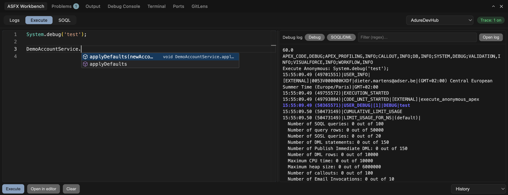
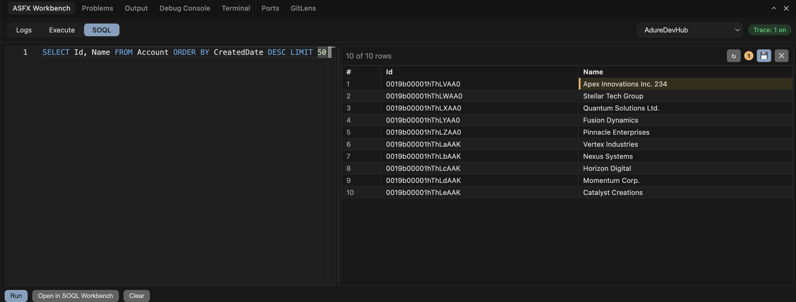
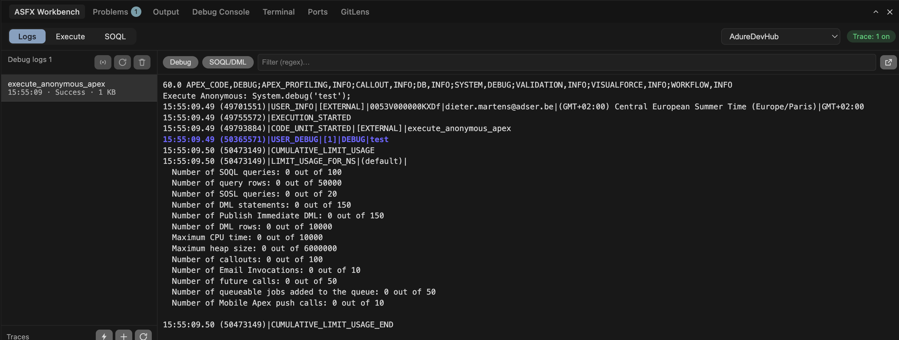
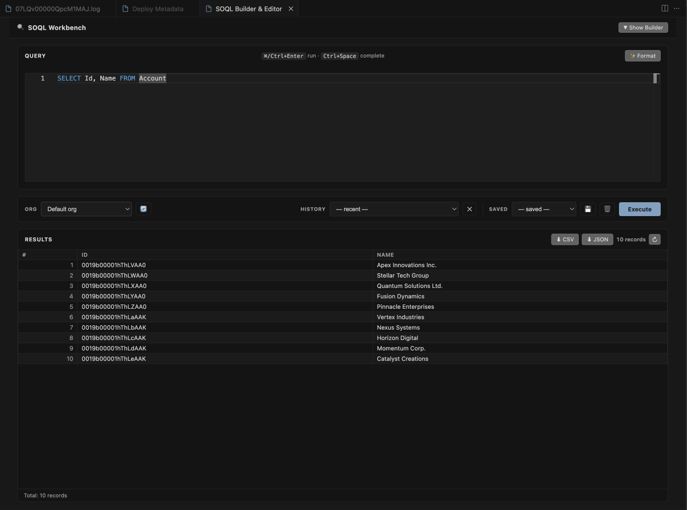
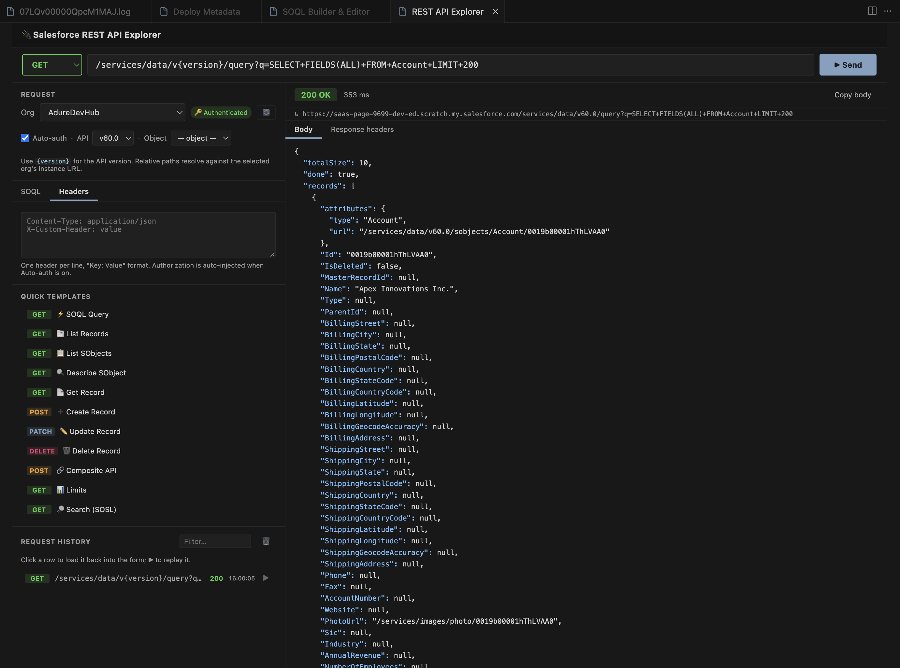
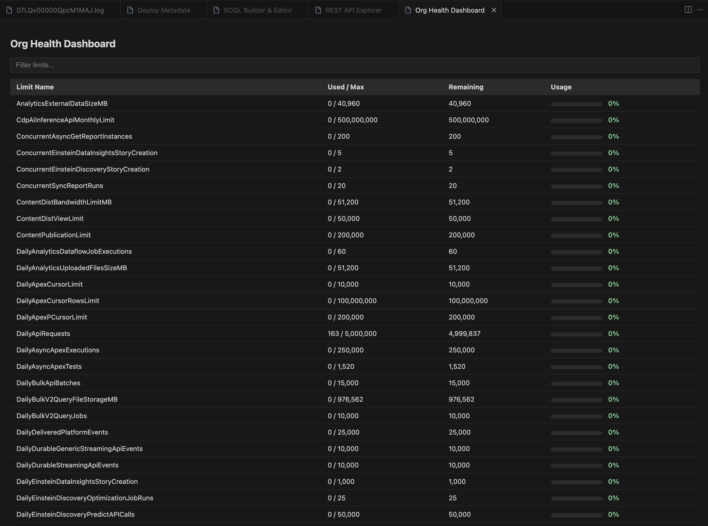

# ASFX Toolkit

ASFX Toolkit is an open-source VS Code / Cursor extension that supercharges your Salesforce development workflow. It bundles org-aware **Apex & SOQL IntelliSense**, log management & debugging, org management, source tracking & deployment, data operations, and API exploration — all without leaving the editor, and all driven by the Salesforce CLI you already have.

> Works on VS Code 1.80+ and Cursor. Activates automatically in any folder containing an `sfdx-project.json`; outside SFDX projects it stays completely inert.

## Features

### 🧠 Apex & SOQL IntelliSense

A built-in, **JVM-free** language server (pure Node, shipped inside the extension) that adds **org-aware** IntelliSense for Apex and SOQL. It runs alongside the official Salesforce Apex extension and only adds what that engine can't: live schema from your connected org.

**SOQL** — in `.soql` files, inline `[SELECT … ]` queries in Apex, and `Database.query('…')` strings:

- Object completion after `FROM`; field completion in `SELECT` / `WHERE` / `ORDER BY`, with type badges.
- **Relationship traversal** — `Account.Owner.Name` resolves through `__r` lookups.
- **Child-relationship subqueries** — `(SELECT … FROM Contacts)`.
- **Type-aware `WHERE`** operators and **picklist value** completion.
- **Rich hover** — fields show type, label, length, help text and picklist values; objects show label, key prefix, custom flag, CRUD flags, field/relationship counts and the admin **Description** (via the Tooling API).

**Apex** — additive to the Salesforce Apex extension:

- **Member completion via declared types** — `acc.` → `Account` fields, `myService.` → your class's members.
- **`new` constructor completion** — suggests the type being assigned first (`Account a = new |`).
- **SObject type-name completion** in declarations, casts, generics and `instanceof`.
- **Outline** and **syntax diagnostics**, **go-to-definition** (in-file and cross-file), and **signature help**.
- **Find references** — every usage of a symbol. A local is confined to the method that declares it, so two methods reusing a name never bleed into each other.

**Org-aware extras:**

- **Namespace-optional matching** — when your `sfdx-project.json` defines a namespace, typing `Widget__c` matches `ns__Widget__c` (the namespace stays in the inserted code; matching is what's optional).
- **Per-document org resolution** — nested / multi-package projects each resolve their own default org, so `billing/force-app/...` uses billing's org.
- **Result weighting** — auxiliary objects (`*History`, `*Share`, `*Feed`, `*ChangeEvent`) and standard audit fields sink below the business objects/fields you actually use.
- **Schema stubs** generated in the background for go-to-definition and to ground AI tooling; refreshed on org switch, pull, and Refresh Metadata.
- **Self-healing** — if the Salesforce Apex Language Server gets stuck, it's restarted (bounded), with a clear notification if it keeps failing.

**LWC → Apex:**

- Cmd+click an imported Apex method lands on the **class and method itself**, not a generated stub.
- Typings come from your `@AuraEnabled` signatures with real parameter and return types, and are regenerated as those change (`lwcApexTypings.autoGenerate`).
- Custom Apex types become TypeScript **interfaces** rather than `any`, inner classes included.
- If a component's IntelliSense is broken — `c/*` imports, subdirectories, Salesforce modules — **Tools → Repair → Repair LWC jsconfig** fixes each `lwc` folder's `jsconfig.json`. Nothing under Repair ever runs on its own.

Schema is read from your **default org** via the REST describe API (auth resolved from `sf org display`); the language server itself stays credential-free. Everything is gated to SFDX projects and individually toggleable — see [Settings](#settings).

### 🧰 ASFX Workbench

A unified bottom panel (sidebar **Tools → ASFX Workbench**) that brings Apex execution, ad-hoc SOQL, and debug logs together, each on its own tab, with a shared org selector and trace indicator.

- **Execute** — run **anonymous Apex** with org-aware completion; the live **debug log** and **governor limits** render side-by-side as it runs. Execute with `Cmd/Ctrl+Enter`, open the result in an editor, or replay from history.
- **SOQL** — fire a quick query against the selected org and browse results in a table; export, or jump to the full **SOQL Builder & Editor**.
- **Logs** — browse the org's debug logs in a syntax-highlighted viewer that colour-codes `USER_DEBUG`, execution markers, and limit usage.

### 🔍 Log Management & Filtering

- **Log Viewer**: List, download, and open Salesforce debug logs from the sidebar. Works with the Salesforce default extensions' log locations.
- **Delete All Logs**: Remove logs from the org (Tooling API with CLI fallback) and clear the local cache in one action.
- **Smart Filtering**:
  - **Debug Filter** (`Cmd+D` / `Ctrl+D`): show only `USER_DEBUG` statements, errors, and exceptions.
  - **SOQL & DML Filter**: show only queries (`SOQL_EXECUTE`) and DML operations.
- **Visual Feedback**: active-state filter icons in the editor title bar; loading indicators for large logs.
- **Live Polling**: automatically poll for new debug logs in the background.
- **Trace Flags**: one-click **Quick Trace** for the current user; view, manage and delete existing trace flags.

### ⚡ Apex & SOQL Tools

- **Execute Anonymous**: Run Apex from the editor (`.apex` files or selections) or the **ASFX Workbench** Execute tab, with live debug log, governor limits, and history.
- **Rerun Last**: Re-run the last executed Apex without re-selecting code.
- **SOQL Builder & Editor** (`ASFXT: Open SOQL Builder & Editor`): build and run SOQL with object/field completion and an optional visual builder, view results in an interactive table, **edit records inline**, **save** changes back to Salesforce, or **discard** edits. Export results to **CSV / JSON**; query history and saved queries are kept per workspace.
- **Apex CodeLens**: Run a specific test method or an entire test class straight from the code.
- **Apex Snippets**: Save, organize, run, edit, and delete reusable Apex snippets from the sidebar and overview panel.

### ☁️ Org Management

- **Org Explorer**: Manage all connected orgs, scratch orgs, and Dev Hubs from a dedicated view.
- **Quick Actions**: open in browser, set as default org / Dev Hub, copy username, rename alias, generate scratch-org password, delete/logout.
- **Scratch Org Wizard**: interactive **Create Scratch Org**, or **Quick Scratch** with sensible defaults in one click.

### 📦 Package Explorer (Dev Hub)

`ASFXT: Package Explorer` — a second-generation (2GP) package control panel for your Dev Hub (also opens from the inline **package** action on a Dev Hub in the Org Explorer).

- **Browse** every 2GP package → its versions, newest first: version number, subscriber (`04t`) and package (`0Ho`) ids as click-to-copy chips, released/beta status, created date, and package aliases from `sfdx-project.json`. A **searchable package combobox**, a version filter, and *Released-only* / *Latest-per-package* toggles keep large packages manageable; results are cached so switching or reopening is instant.
- **Install links & commands** — per version, copy the **Prod** or **Sandbox** install URL, the `sf package install` command, or a paste-ready `sfdx-project.json` **dependency snippet**. Password-protected packages prompt for an installation key.
- **Dependencies view** — a package's declared dependencies (from `sfdx-project.json`) resolved to their concrete ids.
- **Actions** (native confirm + progress): **Install** into any org, **Promote** to released, **Update** or **Delete** a version, **Rename** a package. Optional per-version **code-coverage** column (opt-in, since it's a heavier query).
- **Installed in org** tab — list packages installed in any org (`ASFXT: List Installed Packages`, also on org context menus) with **upgrade** badges when your Dev Hub has a newer released version, plus one-click **Upgrade** / **Uninstall**.
- **Version report** — dependencies + ancestry on demand; **export** a package's versions to Markdown or CSV.

### 🛠️ Development Tools

- **Source Operations**: smart **Push** (diff deploy for source-tracked orgs, sequential package deploy otherwise), **Push (Force)**, **Pull**, contextual **Deploy/Retrieve** for the open file, and **Reset Source Tracking**.
- **Flexible Metadata Deploy Flow** (`ASFXT: Deploy Metadata`):
  - Select paths/files, pick a test level, target any org — the panel always deploys exactly the components you picked (source-tracking conflicts are overridden).
  - **Deployment History**: every deploy persisted with status, duration, test results and timestamp — browse, search and re-run in one click.
  - **Named Test Suites**: save groups of test classes with a preset and reload them instantly.
  - **Pre-Deploy Quality Gate**: scans Apex before deploy for leftover `System.debug()` (warning), hardcoded record IDs (error), SOQL/DML in loops (error), and `TODO`/`FIXME` (info) — review, then abort or deploy anyway.
  - **Test Coverage Display**: post-deploy per-class coverage, colour-coded (≥75% green / ≥50% amber / <50% red) with overall average.
  - **Auto file detection** via a debounced `FileSystemWatcher`; **Deployment Presets** for reusable configs.
- **Test Runner**: run local tests easily.
- **Ignore Helpers**: add files/folders to `.gitignore` or `.forceignore` from explorer context actions.
- **Custom Editors**: friendly UIs for **Permission Sets** (`.permissionset-meta.xml`) and **Scratch Org Definitions** (`project-scratch-def.json`).
- **Explorer tidy**: `ASFXT: Toggle Hide Apex -meta.xml Files` hides/shows the `*.cls-meta.xml` / `*.trigger-meta.xml` sidecar files via `files.exclude` (workspace-scoped, persisted).

### ✅ Apex Test Coverage

Org-wide Apex coverage surfaced three ways, all sharing one **auto-refreshing** store — it updates after a coverage test run (this extension's *Run Apex Tests with Coverage* profile **or** the Salesforce extension's, detected via a watcher on `.sfdx/tools/testresults/`), on panel refresh, and on focus.

- **Explorer badges** — each `.cls`/`.trigger` shows its coverage % (toggle with `ASFXT: Toggle Apex Coverage % Badge`); the exact covered/total lines are always on hover.
- **Coverage panel** (`ASFXT: Apex Coverage`) — overall org %, a classes-below-75% count, and a **worst-first**, searchable table with a below-threshold filter; click a row to open the class. Includes **Refresh** and **Clear results** (deletes local `.sfdx/tools/testresults` and resets the display).
- **Line highlights** (`ASFXT: Toggle Apex Coverage Line Highlights`) — opt-in, persisted covered/uncovered line decorations in the open class that stay live while enabled.

### 🗺️ Object & Process Visualizers

Two graphs for understanding an org, both under **Tools**.

**`ASFXT: Object Visualizer`** — an ERD of the objects you pick and their relationships, with fields inline. Filter, search, and pull in the objects that live in your SFDX project in one click.

**`ASFXT: Process Visualizer`** — what actually happens when a record changes, in order.

- Pick the objects first, then build, so the graph stays readable instead of rendering the whole org.
- An **execution-order spine**: before triggers → validation rules → after triggers → flows → workflow rules, with each automation on the phase it runs in.
- **Full call chains** — `Contact → before update → (trigger → ClassA → ClassB → field is set)`. Apex bodies are scanned for calls and field writes; test classes are left out.
- Automations sharing a phase are grouped in a labelled box with a single edge onward, instead of a fan of crossing lines.
- Scheduled and autolaunched flows link to the objects they operate on with a dotted edge.
- Labelled edges, collision-free layout, re-layout on filter, search that navigates to each hit, and right-click to open any component in the org.

### 🔄 Data Migration Wizard

`ASFXT: Data Migration Wizard` — move entire Salesforce object trees from one connected org to another, with no CSV and no manual ID management.

1. **Source & Target** — choose what the run produces (**Org → Org**, or an **Apex script / CSV / JSON** file), pick orgs, write a root SOQL query, and name it or load a saved preset.
2. **Object Tree** — child relationships are described lazily into a checkable tree (unbounded depth); per object, choose fields and an **external ID / upsert key**. Fields the target org can't accept, and ones it assigns itself (Owner, Record Type, audit), are listed as excluded with the reason rather than silently dropped.
3. **Overview** — lookups that can't be preserved are reported *before* you start, with the objects to add to fix them. Then run, with per-object progress.

**Referential integrity** is preserved by remapping every lookup to the record the run created — a source Id never reaches the target. Self-references (`Account.ParentId`) are re-linked after insert. Objects are ordered topologically, so junction objects land after both parents.

**Undo.** An upsert runs as query-then-write, so the rows it overwrites are read first and can be restored. The results table lists every record created and every record overwritten — old value beside new, Ids linking into their own orgs — each with a checkbox, so you can revert the whole run or just part of it. Reverting restores overwritten rows and deletes created ones, children before parents. Opt into **Revert on failure** to have that happen automatically when any record fails.

**Presets** save per project (`config/asfx/migrations`, committable) or globally. Loading one re-describes against the org, so fields, relationships and upsert keys are real — anything the org no longer has is reported rather than assumed.

**Export instead of migrate.** The same selection and the same rules can produce a file. The **Apex** output is an Anonymous Apex script that resolves lookups through the parent's external Id where there is one, upserts on that key so it is safe to re-run, and splits into parts that each fit the Execute Anonymous window.

Large datasets use REST pagination (no CLI row limits) with `WHERE IN` chunked at 500; writes go through SObject Collections in batches of 200 with partial success. Writing into a production org is confirmed first.

### 📂 Data Export / Import

`ASFXT: Data Export / Import` — a full data panel:

- **Export** any SOQL query to CSV or JSON in your workspace, openable in one click.
- **Import** a CSV with preview and auto-guessed SObject: **Insert**, **Update** (needs `Id`), **Upsert** (single external-ID field *or* a 2–3 column composite key resolved client-side), or **Delete** by `Id`. Live progress, per-record errors, and a results summary.

Auth is resolved automatically from `sf org display`.

### 🔌 REST API Explorer

`ASFXT: REST API Explorer` — a built-in Salesforce REST client with zero auth setup.

- **Request builder**: org selector with auto `Authorization: Bearer` injection; GET/POST/PATCH/PUT/DELETE; relative or full URLs with `{version}` substitution; headers and JSON body editors; 10 quick templates (List/Describe SObjects, SOQL, CRUD, Composite, Limits, SOSL); request history.
- **Response viewer**: colour-coded status badge with timing, resolved URL, pretty syntax-highlighted JSON, response headers table, copy-body.

All calls are made server-side (Node `https`) — no CORS issues.

### 🩺 Org Health Dashboard

`ASFXT: Org Health` — a sortable, filterable dashboard of your org's **limits** (API requests, storage, async Apex, streaming events, and more), each with used/max, remaining, and a colour-coded usage bar so you can spot what's running hot at a glance.

### ⚙️ System & Setup

- **Project Validation**: checks for `sfdx-project.json`; features and views hide outside SFDX projects.
- **Output Logging**: detailed logs in the **ASFX Toolkit** output channel (suppressed during deploys, opened on errors).
- **Interpreted error panel**: any failed CLI or command operation — push, pull, deploy, retrieve, test run, scratch org — opens one panel with the exact Salesforce message, a plain-language cause and fix where it's recognised, a click-through to the offending file, and the original payload on demand. The full payload still goes to the log; the panel never replaces the record.
- **Configurable**: see [Settings](#settings).

## Keyboard Shortcuts

| Shortcut | Action |
| --- | --- |
| `Cmd+Enter` / `Ctrl+Enter` | Execute anonymous Apex (in `.apex`) |
| `Cmd+D` / `Ctrl+D` | Toggle debug-focused log filter (when viewing logs) |
| `Alt+L` | LWC: navigate to sibling picker |
| `Alt+1` / `Alt+2` / `Alt+3` / `Alt+4` | Jump to LWC JS / HTML / Meta / CSS |

## Settings

All settings live under the `adure-sfx-toolkit.*` namespace.

### Apex & SOQL IntelliSense

| Setting | Default | Description |
| --- | --- | --- |
| `soql.enableCompletion` | `true` | Org-aware SOQL completion in `.soql` files (and inline SOQL in Apex). |
| `apex.enableCompletion` | `true` | Org-aware Apex completion (SObject fields on `var.`, `new` constructors, type names). Turn off to defer entirely to the Salesforce extension. |
| `apex.languageServer` | `on` | Apex *semantic* features (outline, syntax diagnostics, go-to-definition for your classes, signature help). `on` (default) always enables them; `auto` enables them only when the Salesforce Apex extension is **not** installed; `off` disables. |
| `apex.generateSObjectStubs` | `true` | Generate SObject schema stubs in the background (go-to-definition + AI grounding), refreshed on org switch / pull / Refresh Metadata. |
| `apex.stubScope` | `referenced` | `referenced` (lean) generates stubs only for objects used in your code; `all` also writes type-only stubs for every org object (heavier). |
| `apex.restartAfterInitialLoad` | `true` | Once, after the Salesforce Apex LS finishes loading, do a single clean restart so newly generated stub types are indexed (never restarts mid-index). |
| `apex.monitorLanguageServer` | `true` | Watch the Salesforce Apex LS and recover it if it crashes and stays down (bounded; shows an error if it keeps failing). |
| `apex.autoRestartLanguageServer` | `false` | Restart the Salesforce Apex LS after every stub change. Off by default — the Salesforce LS already picks up changes incrementally. |
| `apex.validateSemantics` | `true` | Flag unknown fields on a typed SObject variable against the org's schema. |
| `apex.validateOnSave` | `true` | Re-run Apex validation when a file is saved. |
| `lwcApexTypings.autoGenerate` | `true` | Keep `@salesforce/apex` typings in step with your `@AuraEnabled` methods automatically, instead of only on command. |

### Logs, traces, deploy & API

| Setting | Default | Description |
| --- | --- | --- |
| `liveLogIntervalSeconds` | `5` | Background poll interval for new debug logs. |
| `maxLogFiles` | — | Maximum number of logs to fetch. |
| `quickTraceDurationMinutes` | — | Quick Trace duration. |
| `quickTraceDebugLevel` | — | Debug level used by Quick Trace. |
| `toolingApiVersion` | `v67.0` | Salesforce API version for REST/Tooling calls and `{version}` substitution. |
| `parallelDeletes` | `8` | Parallel API calls when deleting logs. |
| `testRunTimeoutMinutes` | — | Timeout for test runs. |
| `autoSaveBeforePush` | — | Save dirty editors before a push. |
| `httpTimeoutMs` | — | Timeout for REST/Tooling calls made by the extension. |
| `deploy.liveStatus` | `true` | Poll and show component-level progress while a deploy runs. |
| `apexLog.highlightPatterns` | — | Extra patterns highlighted in the log viewer. |
| `warnOnProductionOrg` | `true` | Confirm before an operation that writes to a production org or Dev Hub. |
| `telemetry.enabled` | `true` | Anonymous usage counts — see [Telemetry](#telemetry). |

## Requirements

- A Salesforce **DX project** (`sfdx-project.json` in the workspace).
- The **Salesforce CLI** (`sf`) installed and authenticated to your orgs — used for auth and several operations.
- The official **Salesforce Apex extension** is recommended (ASFX Toolkit's Apex IntelliSense runs alongside it); SOQL features work without it.

## Telemetry

The extension collects **anonymous** usage telemetry to understand how many people
use it and which features are valuable, so development can be prioritized. We collect:

- Extension activation and an anonymous, randomly generated install id
- Which commands and panels are used, with execution duration and success/failure
- Coarse error categories (e.g. `auth`, `network`, `cli`) — never raw messages
- Key feature actions: running a SOQL query, sending a REST request, exporting/
  importing data, running a migration, executing anonymous Apex
- Deploy / test outcomes as categorical flags and counts

We **never** collect access tokens, usernames, org ids, record ids, file paths,
SOQL/Apex text, query results, or any personal data.

To opt out, set `adure-sfx-toolkit.telemetry.enabled` to `false`. Telemetry also
honors VS Code's global `telemetry.telemetryLevel` setting — disabling either turns
it off.

## 💜 Support / Sponsor

Adure SFX Toolkit is free and open source, built and maintained in our spare time.
If it saves you time, please consider [**sponsoring its development**](https://github.com/sponsors/AdureIO).
Sponsorships fund ongoing maintenance, new features, and faster bug fixes — and are
hugely appreciated. ⭐ Starring the [repository](https://github.com/AdureIO/SFX-Toolkit)
and leaving a [Marketplace review](https://marketplace.visualstudio.com/items?itemName=AdureIO.sfx-toolkit&ssr=false#review-details)
helps too.

## Open Source

Contributions, issues, and feature requests are welcome — see the [GitHub repository](https://github.com/AdureIO/SFX-Toolkit).

Bundled open-source components are listed in [THIRD-PARTY-LICENSES.md](THIRD-PARTY-LICENSES.md).

## Feedback

Found a bug or have a suggestion? Please file an issue on the GitHub repository.
